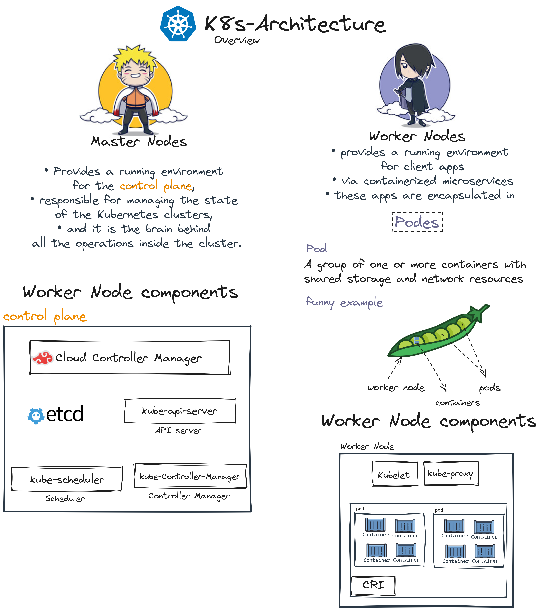
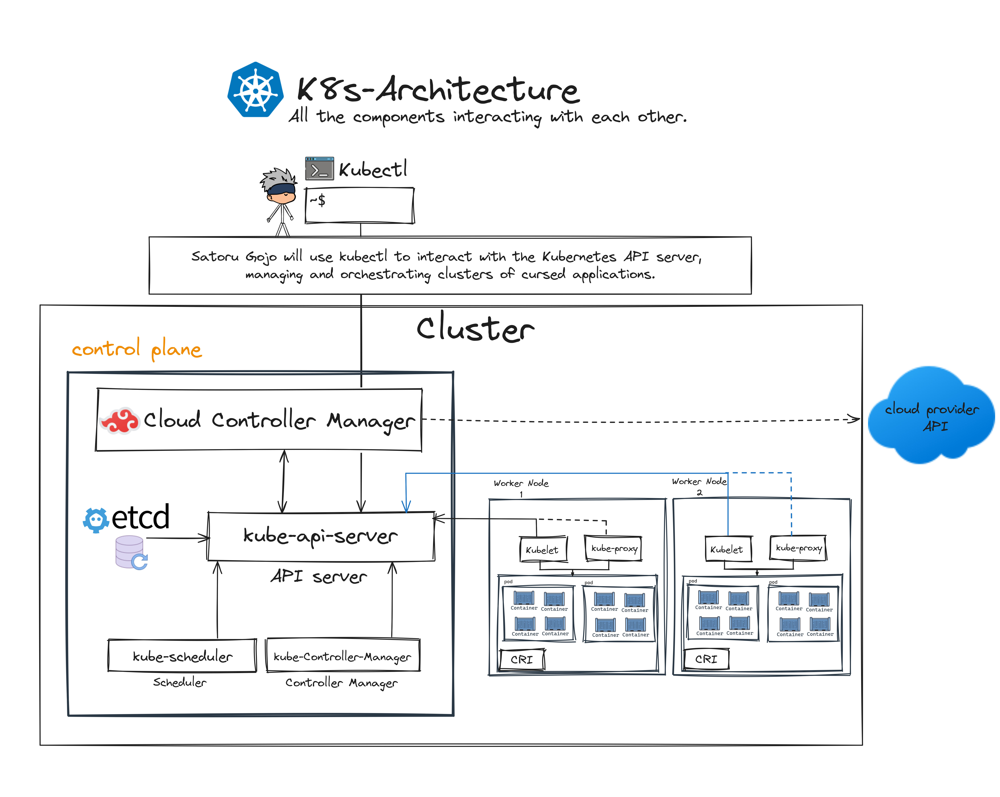

# K8s-Insights

  
   
   <samp>
     Note that this repository is under improvement, and it is just insights to know what Kubernetes is.
  </samp>  

### Table of content

1. [K8s-Architecture - _Overview_.](#desc0)
   - [_Overview_.](#desc0,0)
   - [Worker Node components.](#desc0,1)
   - Master Node components. 
2. [K8s-Architecture - _All the components interacting with each other_.](#desc1)

### K8s-Architecture - _Overview_.

#### Worker Node components
- Container run time.
    - Manages the execution of containers via the **Container Runtime Interface (CRI)**.
    - Examples: **containerd**, **cri-o**. 
- Node Agent "Kubelet".
    - An agent running on each worker node communicates with the control plane components from the master node..
    - Listens for **Pod** specifications from the **API server**.
    - Ensures the specified containers are running and healthy.
    - Reports back to the **control plane** about the node's status. 
- Proxy "kube-proxy".
    - Maintains network rules on each node.
- Addons "DNS, Dashboard User Interface, Monitoring and logging".
    - Cluster features and functionality not yet available in Kubernetes, therefore implemented with third-party pods and services.

### K8s-Architecture - _All the components interacting with each other_.

